# Flappy Learns

A beginner-friendly static HTML/CSS/JavaScript project about teaching a neural network to play Flappy Bird.

## Contribution flow

```mermaid
flowchart LR
    align[Align on intent] --> issue[Create issue]
    issue --> branch[Create branch]
    branch --> worktree[Create worktree]
    worktree --> codeTest[Code + local tests]
    codeTest --> commit[Commit]
    commit --> push[Push]
    push --> pr[Open pull request]
    pr --> review[CI and review]
    review --> merge[Approve and merge to main]
```

## Run it

Open `index.html` in a browser. There are no dependencies to install.

Or play the live site: [Flappy Learns on GitHub Pages](https://lupovita.github.io/my_flappy/).

## Current milestone

- Playable keyboard/tap Flappy Bird game
- Three teaching decks: the game, neural-network architecture, and evolutionary training
- Manual perceptron lab: tune five input weights and one bias while watching live activations
- Evolution Arena: 63 birds with 6 → 4 → 4 → 1 networks, five courses per generation, and top-three selection

The arena grows harder during each race: pipes move faster and their gaps narrow. Obstacle speed is included as the sixth network input.
